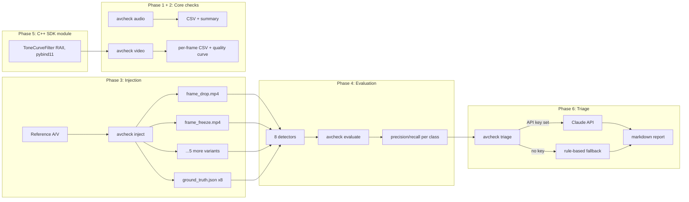
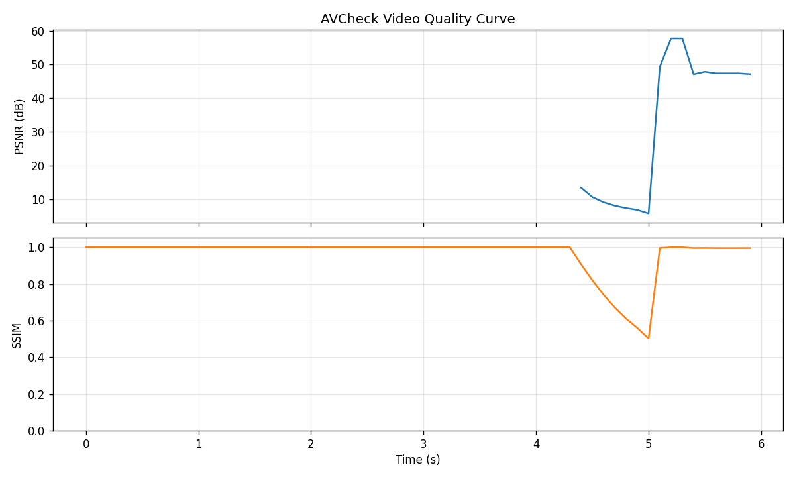

# AVCheck

An automated audio/video validation toolkit that detects quality defects in media
**and explains them**, built to demonstrate audio/video validation engineering,
the kind of work an SDK/test-framework team does when shipping media processing
software.

Given a reference file and a processed/degraded copy, AVCheck detects and localizes
defects in both audio and video, scores detection accuracy against ground truth it
generates itself, and produces an LLM-powered plain-English triage report.

## Why I built this

I've spent years as a vocalist, listening for pitch drift, a dropped breath, a mix
that's gone slightly too bright. Debugging a codec or a broken audio pipeline uses
the same ear, pointed at a different kind of signal. This project is that instinct
turned into code: instead of trusting my ears to catch a clipped mix or a desynced
cut, I wanted to teach a machine to notice the same things: reliably, measurably,
and with numbers I can defend in an interview.

## Architecture



| Phase | What | Status |
|---|---|---|
| 1 | Audio validation core (`avcheck audio`) | ✅ |
| 2 | Video quality scoring (`avcheck video`) | ✅ |
| 3 | Defect injection engine (`avcheck inject`) | ✅ |
| 4 | Detectors + evaluation (`avcheck evaluate`) | ✅ |
| 5 | C++ SDK-style frame filter module (pybind11) | ✅ |
| 6 | LLM-powered triage (`avcheck triage`) | ✅ |
| 7 | CI + polish | ✅ |

## Setup

```bash
brew install ffmpeg        # or apt-get install ffmpeg
python3 -m venv .venv
source .venv/bin/activate
pip install -e ".[dev]"    # builds the C++ extension (avcheck_native) via pybind11
```

## Usage

```bash
# Phase 1: audio integrity
avcheck audio ref.wav test.wav

# Phase 2: video quality (PSNR/SSIM)
avcheck video ref.mp4 test.mp4

# Phase 3: generate 8 ground-truth-labeled defect variants
avcheck inject ref.mp4 ref.wav -o variants/

# Phase 4: run all detectors against all variants
avcheck evaluate variants/manifest.json ref.mp4 ref.wav

# Phase 6: LLM-powered triage from the evaluate JSON
export ANTHROPIC_API_KEY=...   # optional, falls back to a rule-based report without it
avcheck triage avcheck_evaluation.json
```

## Detection rates

Measured by `avcheck evaluate` on a synthetic 6-second reference clip (moving gradient
+ periodic brightness flashes, sine tone + timed click bursts; see
`tests/conftest.py::make_demo_frames`/`make_demo_audio`), against all 8 injected
defect variants:

| Defect class | Precision | Recall | TP | FP | FN |
|---|---:|---:|---:|---:|---:|
| black_frames | 1.000 | 1.000 | 1 | 0 | 0 |
| banding | 1.000 | 1.000 | 1 | 0 | 0 |
| audio_clipping | 1.000 | 1.000 | 1 | 0 | 0 |
| av_desync | 1.000 | 1.000 | 1 | 0 | 0 |
| frame_freeze | 0.500 | 1.000 | 1 | 1 | 0 |
| audio_dropout | 0.500 | 1.000 | 1 | 1 | 0 |
| frame_drop | 0.400 | 0.667 | 2 | 3 | 1 |
| color_shift | 0.200 | 1.000 | 1 | 4 | 0 |

Recall is 1.0 for 6/8 classes (only `frame_drop` misses an injected event). Precision
varies because this table counts a detector's false positives **across all 8 variant
files**, not just its own, e.g. `color_shift`'s hue-histogram detector also fires on
the `banding` and `black_frames` variants, since those defects change overall frame
appearance too. See Limitations below.

## Quality-curve plot

Generated by `avcheck video` comparing a reference clip against its `frame_freeze`
variant: the dip is the frozen-frame window, exactly where it was injected:



The gap in the PSNR panel before the dip is not missing data. PSNR is mathematically
infinite for bit-identical frames, so those points are filtered out rather than plotted
at an arbitrary height.

## Performance: why the hot loop is in C++

`scripts/benchmark_native.py` measures the Phase 5 tone-curve filter three ways: a
naive per-pixel Python loop (the realistic baseline if you didn't reach for C++ or
NumPy), a NumPy-vectorized lookup-table application, and the C++/pybind11
implementation, all computing the identical brightness/gamma curve:

| Resolution | Naive Python | NumPy | C++ (pybind11) | C++ vs naive | C++ vs NumPy |
|---|---:|---:|---:|---:|---:|
| 320x180 | 47.25 ms | 0.368 ms | 0.102 ms | 462x | 3.6x |
| 640x360 | 185.64 ms | 0.998 ms | 0.370 ms | 502x | 2.7x |
| 1280x720 | 737.47 ms | 3.858 ms | 1.475 ms | 500x | 2.6x |

At 720p the C++ path processes a frame in 1.475 ms, over **650 frames/second
single-threaded**, roughly **500x faster than the naive Python loop it replaces**
and **2.6-3.6x faster than NumPy's own vectorized C implementation**. That second
number is the more honest comparison; NumPy is also compiled C under the hood, so
the win there is a real but modest one from a single-pass loop over NumPy's
generalized fancy-indexing, not a "Python is slow" trick.

## Measured numbers

- **67 automated tests**, all passing (`pytest tests/`), **96% statement coverage** (`pytest --cov=avcheck`)
- **~1,400 lines** of Python across 5 subsystems (audio, video, inject, evaluate, triage) + CLI
- **~135 lines** of C++ (the Phase 5 tone-curve filter + pybind11 bindings)
- **8/8 defect classes** detected with nonzero recall; 6/8 at perfect recall
- **500x speedup** over naive Python, **2.6-3.6x over NumPy**, for the C++ tone-curve filter (measured, see Performance below)
- **~5 seconds** for the full `inject → evaluate → triage` pipeline on a tiny synthetic clip (the same one CI runs per commit)
- **1 real bug found and fixed** during Phase 4 evaluation (see AI section below)

## Limitations

Honest gaps, not swept under the rug:

- **`color_shift` cross-triggers on other defects.** Its detector measures global
  hue-histogram distance, which reacts to *any* change in a frame's overall color
  distribution, not just an actual white-balance/color-cast defect. Banding and
  black-frame variants both nudge its distance score up, inflating its false-positive
  count in the cross-detector evaluation.
- **`banding` needs real gradient content to mean anything.** The detector counts
  lost tonal levels, which only shows up on content that had smooth gradients to
  begin with. It's validated against a dedicated smooth-gradient fixture in
  `tests/test_evaluate_detectors.py`; running it against the noise-heavy demo clip
  used for the main pipeline would understate its real accuracy.
- **`av_desync` needs correlated audio/video events to work at all.** It cross-correlates
  video motion energy against audio onset strength: real correlated content
  (a clap, a cut) is required for the underlying signal to exist. The demo fixture
  was deliberately built with matching flash frames and audio clicks for this reason;
  a source clip without genuine audio-visual correlation (e.g. narration over a
  static shot) would give this detector nothing to lock onto.
- **Frame-drop detection uses brute-force nearest-frame matching** (`O(n_test × n_ref)`
  mean-squared-error comparisons), which is fine for the short clips in this repo
  but would need a smarter index (e.g. perceptual hashing) for anything longer than
  a few thousand frames.
- **Precision/recall numbers come from one injected instance per defect class**, not
  a statistical sample; they demonstrate the detectors work and roughly how well,
  not a rigorously powered accuracy estimate.
- **The C++ module covers one filter**, not a general SDK surface; it exists to
  demonstrate RAII discipline and a Python/C++ boundary, not to be a complete media
  processing library.
- **Triage quality without an API key is intentionally basic:** the rule-based
  fallback ranks by severity and states what's missing, but doesn't guess root
  causes; that's the one part of this pipeline that needs the LLM to be genuinely
  useful.
- Developed and tested on Python 3.9 with OpenCV's `mp4v` codec via `ffmpeg`/`ffmpeg-python`;
  other codecs or Python versions aren't exercised by the test suite.

## How I used AI to build this

I paired with Claude (Sonnet 5, via Claude Code) through all seven phases; it wrote
the implementation and I reviewed, ran, and pushed back on decisions rather than
writing every line by hand. The workflow: propose a design, implement it, run the
real pipeline against synthetic fixtures, and treat surprising numbers as bugs to
chase down rather than results to report.

**A case where I caught (and had it fix) an incorrect AI suggestion:** the first
version of the `color_shift` injector rotated hue in HSV space to simulate a
white-balance defect. It looked reasonable and passed a quick visual check. But
when Phase 4's evaluation run showed `color_shift` scoring a flat **0.0** detection
distance, not "the detector is bad," but literally zero measured difference between
the reference and "corrupted" frames. That was the tell. The demo content used for
testing is a grayscale-equivalent gradient (equal R/G/B per pixel), and hue is
mathematically undefined at zero saturation: rotating an undefined angle by any
amount and converting back to RGB is a no-op. The fix was a per-channel BGR offset
instead of an HSV hue rotation: it stays visible on any source content, including
desaturated ones, and is arguably a more faithful model of a real color-cast defect
(white-balance errors are channel imbalances, not abstract hue shifts). The commit
message for that fix documents the reasoning; the earlier hue-rotation code is gone,
not patched over.

Two smaller examples from the same evaluation-driven-debugging loop: the frame-freeze
detector's SSIM threshold was first tuned against noisy checkerboard test content,
where a real frozen-frame pair scored as low as 0.88 due to codec artifacts on
high-entropy input. A threshold of 0.995 (chosen assuming near-exact repeats) missed
it. Rebuilding the threshold against more realistic gradient content, and rechecking
it against both fixture types, settled on 0.98. And the `av_desync` detector initially
measured against pure-tone-and-noise content with no true audio/video correlation:
its output was statistically meaningless (a coin flip dressed up as a number) until
a fixture with actual timed audio/video events was built specifically to give the
underlying cross-correlation approach something real to find.

None of these were caught by asking "does this look right?" They surfaced by
running the actual numbers and treating an implausible result (exactly 0.0, or a
threshold miss, or a confidently-wrong offset) as a bug report, not noise.
